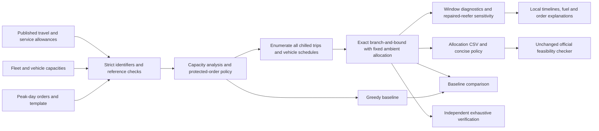
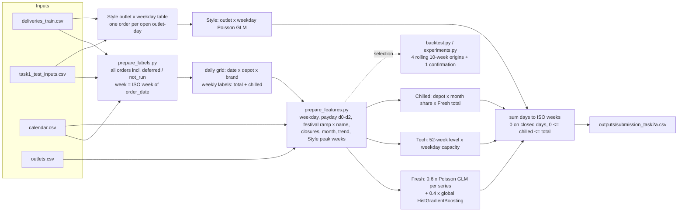
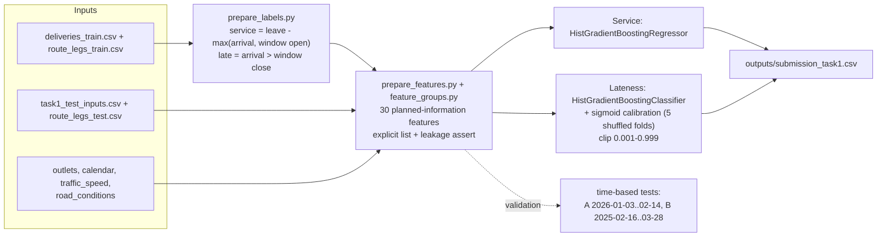

# Architecture: Task 2A and Task 1 pipelines

## Task 2B: capacity and allocation

This is a local optimisation pipeline with no trained model or external solver
dependency. The exact certificate covers chilled assignments under the chosen
policy, with ambient packing fixed. Windows and one-day fuel are approximate
diagnostics; they do not certify physical return/reload execution or weekly fuel.

## Task 2A: weekly depot demand forecast

## Task 1: service time and lateness (updated)

## Proposed deployment

- **Task 2A (capacity planning): a weekly batch.**
  - **When:** every Sunday night, after the week's orders close.
  - **What:** refresh labels from the order system, then refit the configuration on all history. This takes seconds; it's GLMs plus one small boosting model.
  - **Output:** a 10-week depot × brand forecast, with chilled volume, published to the dispatcher's capacity screen.
  - **Monitoring:** compare each week's actuals with the forecast (WAPE and bias per series). Re-run the backtest monthly.
  - **Calendar:** has to be maintained ahead of time, because festival dates and closures drive the largest swings.
- **Task 1 (daily delivery planning): dispatch-morning scoring.**
  - **When:** after the plan is built and before vehicles leave. That's when road advisories (`disruption_index`) are known.
  - **What:** score every planned stop for expected service time and late probability. The dispatcher sees high-risk stops before departure.
  - **Retraining:** monthly, from the completed route records, keeping the season-matched validation and the calibration check (mean predicted vs actual late rate by month).
- **Serving:** both models are scikit-learn pipelines saved with joblib, loaded by a small batch job (`predict_task2a`, and the Task 1 inference cell). Versions are pinned in `requirements.txt`.
